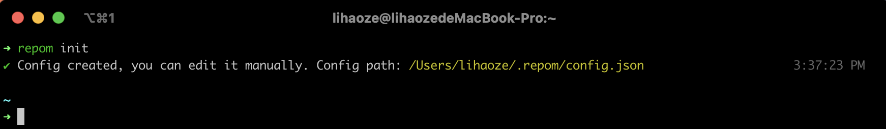
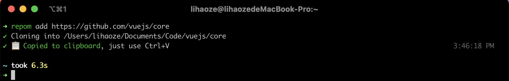
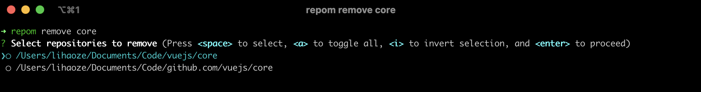
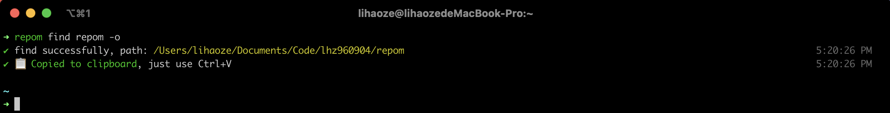
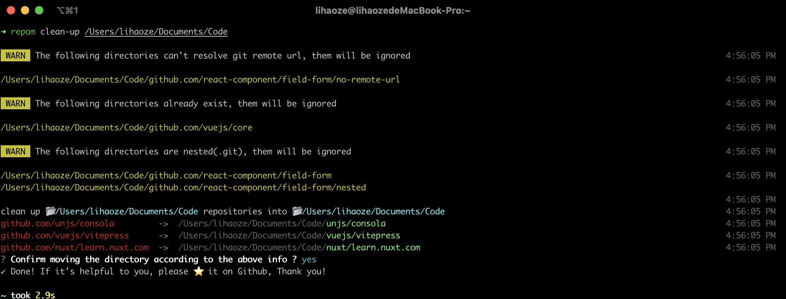

# repom

> CLI for manager git repositories easily, Inspiration by [projj](https://github.com/popomore/projj)

[](https://www.npmjs.com/package/repom)


## Overview

`repom` provide a structure storage repository

```
.$BASE_DIR
├── github.com (optional)
│  └── vuejs (optional)
│       ├── core
│       └── docs
├── gitlab.com
│   └── owner
│       ├── repoA
│       └── repoB
```

And you can use command to manager your repositories.

## Install

```bash
npm install -g repom
```

## Usage

### Initialize

```bash
repom init
```



Set base directory which repositories will be cloned to, default  `~/Users/Documents/Code`.

You can change base directory in `~/.repom/config.json`.

### Add repository

```bash
repom add https://github.com/lhz960904/repom.git
```



You can add `-o` option if you register `code` command, will auto open repo by VSCode

### Remove repository

```bash
repom remove <name>
```



Support  fuzzy match. Multiple selections can be made if multiple matches are found

### Find repository

```bash
repom find <name>
```


You can add `-o` option if you register `code` command, will auto open repo by VSCode

### 🚨 Clean up exist dircatory

> the command will clean up existed directories to base dir, **can't roll back** .

```bash
repom clean-up <dir>
```



## Config

- `baseDir` : Repositories will be cloned to, default  `~/Users/Documents/Code`.
- `groupBy` : Group according to the following option
  - `source` : git remote url. e.g.  `https://github.com/lhz960904/repom.git`  match to  `github.com`
  - `owner` : repository owner. e.g.  `https://github.com/lhz960904/repom.git`  match to  `lhz960904`
